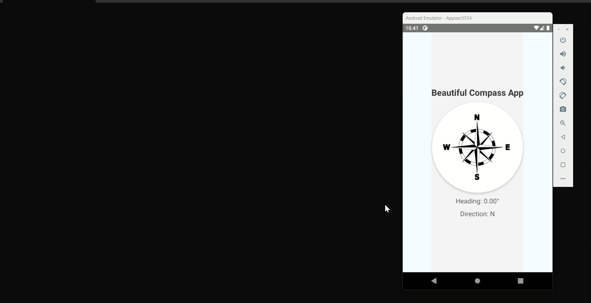

# React Native Compass App

Welcome to the React Native Compass App! This mobile application serves as a digital compass, helping you navigate your way with ease. Whether you're exploring the great outdoors or simply need to find your direction, this app has you covered.

## Features

- **Real-time Compass:** Utilize the device's sensors to provide accurate real-time compass readings, ensuring you always know which direction you're facing.
- **Smooth User Experience:** Enjoy a smooth and responsive user experience, with minimal latency in compass updates.
- **Simple Interface:** The app features a clean and intuitive interface, making it easy to understand and use for users of all levels.
- **Minimal Permissions:** Requires minimal permissions, ensuring user privacy and security.

## Setup

1. **Clone the Repository:** Begin by cloning the repository to your local machine.
```bash
git clone https://github.com/602dhruviii/Compass-React-Native.git
```
2. **Start Using:** Launch the server to run the application.

```bash 
npm start
```
## Technologies Used

- React
- React Native

## Working 

